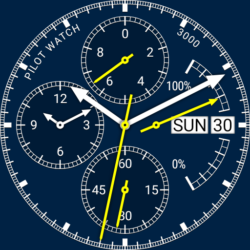

# Pilot Watch 3000

[Pilot Watch 3000](https://webonastick.com/wear-os/pilot-watch-3000/)
is an analog watchface with a chronograph (stopwatch) function. It's like most slide-rule chronograph watches, but without the slide rule.

Source code is on [GitHub](https://github.com/dse/wear-os-watchface-pilot-watch).

## Changes

### v1.1.0 (upcoming)

-   Companion Android app for watch face installation on Android Wear 1.x watches.

-   10-second ambient refresh.

-   Watch face displays its own name now.  Just a little touch of branding.

    You can tap the words "Pilot Watch" to display the application's version number (e.g., "1.1.0") and version code (e.g., "(90)").

    This is useful for telling me what version of the watch face you're running.  :-)

-   A few layout tweaks.

### v1.0.0

-   Initial Release

## Featured in...

-   [This YouTube review](https://www.youtube.com/watch?v=B-XZ6ustzoI) of three smartwatches.

## License

[GPL2](COPYING.txt)
